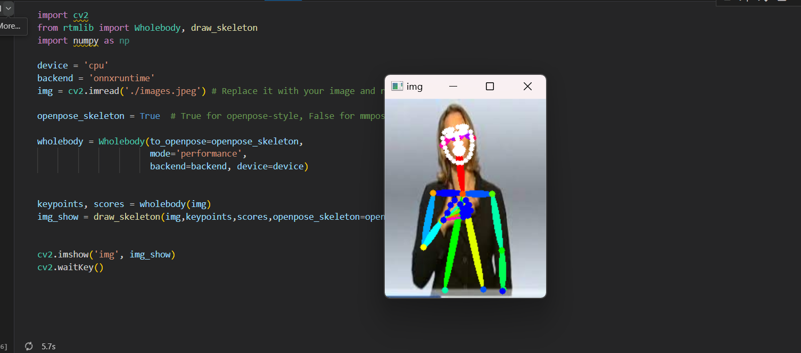

# Dissertation

This is my Research Project: Effectiveness of multi-scaling keypoints for Sign Language Translation

The dataset can be downloaded is PHOENIX14T dataset: https://www-i6.informatik.rwth-aachen.de/~koller/RWTH-PHOENIX-2014-T/ 
Due to size constraints: Example data can be found at the ExampleData Foulder.

# Generated Example

# Information about the Code
The code consists of Three sections:
- DWPose_RTMB: This is the rtmlib from Jiang, Tao (https://github.com/Tau-J/rtmlib) This part of the code is to perform DWPose and draw the skeletal keypoints for the poses. Do know that the code was also changed to make it compatible with our project.

- Counter_embedding: Add Counter Values in the skeleton keypoints estimates (This is done right after pose estimation for the dataset)

- Progressive Transformer: Adjusted version of Ben Saunders Progressive Transformer(saunders2020progressive) to make it DWPose compatible.

Remark: Each work contains its own Liscene and Readme File. Though the main model is based on Progressive Transformer(saunders2020progressive), we used some of the code from https://github.com/adamg4911/diss by Adam George.

To run the progressive Transformer: 
- Each folder contain its own set of requirements.txt folder. To run the code, all the required libraries first need to be downloaded.
- First download the Pheonix14T dataset. 
- To perform DWPose Pose estimation run the dw_extract.py file located in DWPose_RTMB. ( or you can run the "demo.ipynb" file on a single image, an image from Pheonix14T is also included for testing if interested )

  
- Ensure that the skeleton poses is in a file ending with ".skels", further instruction is in Progressive transformer foulder.
- Pass the Skeleton ".skels" file into the counter_embedding.py file to perform counter embedding, make sure to do this for each dataset. 
- Then finally adjust the configuration file as needed, make sure that you have skels, .file and .gloss for all training, validation and test set (as shown in the ExampleData folder)
- Then put all the files into the sign_data foulder in Progressive Transformer folder. (adjust the dw_plot_video.py scaling value according to the normalisation done to keypoints)
- Run the training.py file in the Progressive Transformer folder ( make sure the correct config is utilised, can seen in the #Change here# section)

- Remark: dw_plot_video.py is important for drawing skeleton poses for DWPose, it uses code form rtmlib( https://github.com/Tau-J/rtmlib ) and implemented in a way to be compatible with the transformer.

Code resource used is all from the code cited below: 

# Citation        
    @misc{rtmlib,
      title={rtmlib},
      author={Jiang, Tao},
      year={2023},
      howpublished = {\url{https://github.com/Tau-J/rtmlib}},
    }
    
    @misc{jiang2023,
      doi = {10.48550/ARXIV.2303.07399},
      url = {https://arxiv.org/abs/2303.07399},
      author = {Jiang, Tao and Lu, Peng and Zhang, Li and Ma, Ningsheng and Han, Rui and Lyu, Chengqi and Li, Yining and Chen, Kai},
      keywords = {Computer Vision and Pattern Recognition (cs.CV), FOS: Computer and information sciences, FOS: Computer and information sciences},
      title = {RTMPose: Real-Time Multi-Person Pose Estimation based on MMPose},
      publisher = {arXiv},
      year = {2023},
      copyright = {Creative Commons Attribution 4.0 International}
    }
    
    @misc{lu2023rtmo,
          title={{RTMO}: Towards High-Performance One-Stage Real-Time Multi-Person Pose Estimation},
          author={Peng Lu and Tao Jiang and Yining Li and Xiangtai Li and Kai Chen and Wenming Yang},
          year={2023},
          eprint={2312.07526},
          archivePrefix={arXiv},
          primaryClass={cs.CV}
    }

    @inproceedings{saunders2020progressive,
    	title		=	{{Progressive Transformers for End-to-End Sign Language Production}},
    	author		=	{Saunders, Ben and Camgoz, Necati Cihan and Bowden, Richard},
    	booktitle   	=   	{Proceedings of the European Conference on Computer Vision (ECCV)},
    	year		=	{2020}}
    
    @inproceedings{saunders2020adversarial,
    	title		=	{{Adversarial Training for Multi-Channel Sign Language Production}},
    	author		=	{Saunders, Ben and Camgoz, Necati Cihan and Bowden, Richard},
    	booktitle   	=   	{Proceedings of the British Machine Vision Conference (BMVC)},
    	year		=	{2020}}
    
    @inproceedings{saunders2021continuous,
    	title		=	{{Continuous 3D Multi-Channel Sign Language Production via Progressive Transformers and Mixture Density Networks}},
    	author		=	{Saunders, Ben and Camgoz, Necati Cihan and Bowden, Richard},
    	booktitle   	=   	{International Journal of Computer Vision (IJCV)},
    	year		=	{2021}}

    @misc{diss,
      author = {Gonzalez, Adam},
      title = {diss},
      howpublished = {\url{https://github.com/adamg4911/diss}},
      year = {2023},
    }
